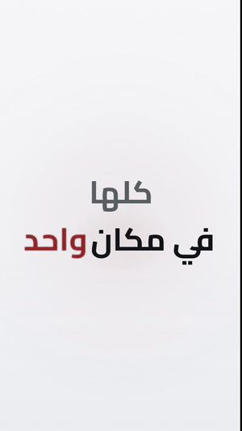
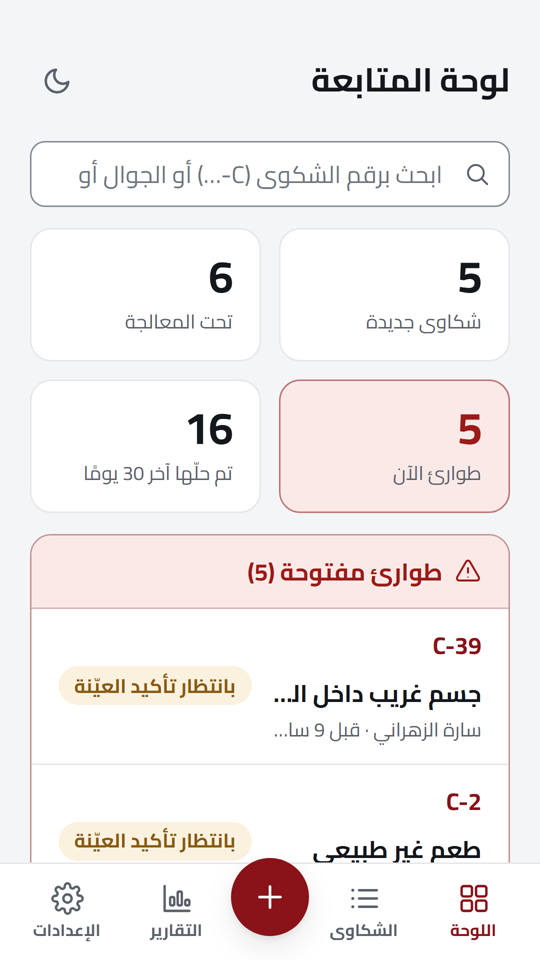
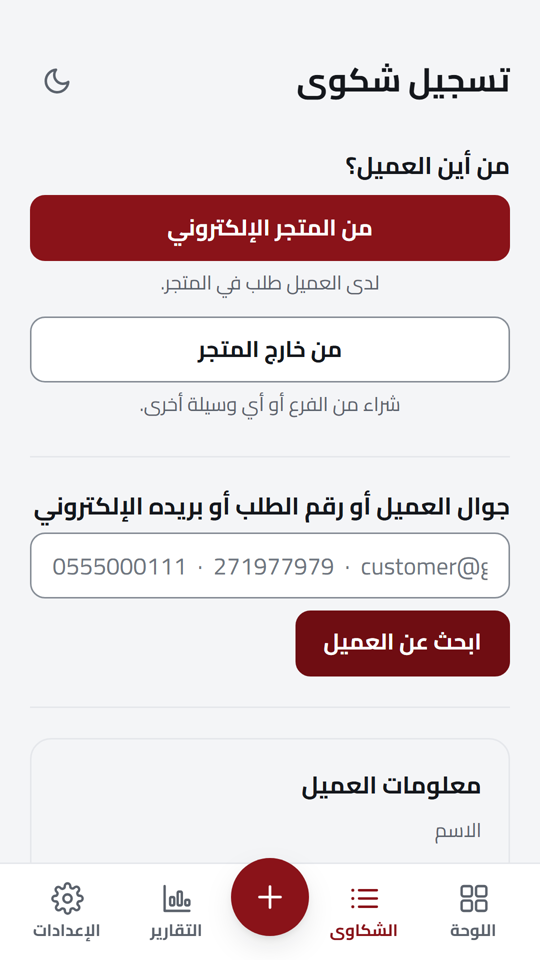
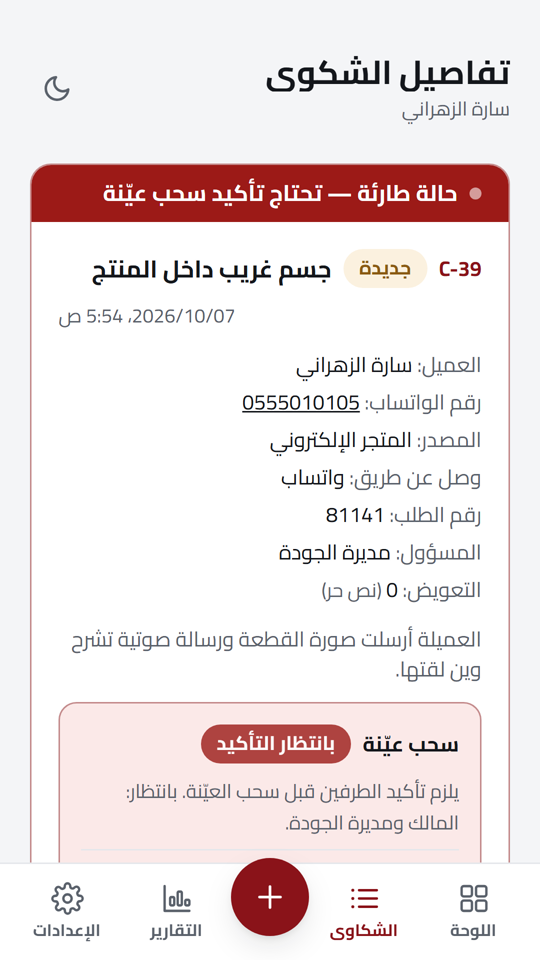
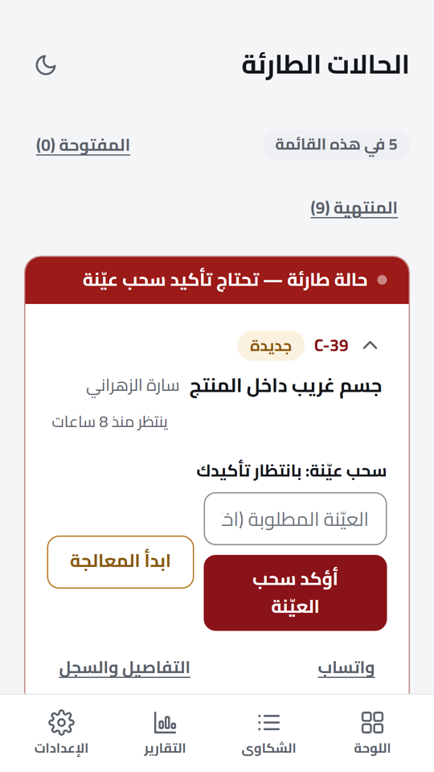
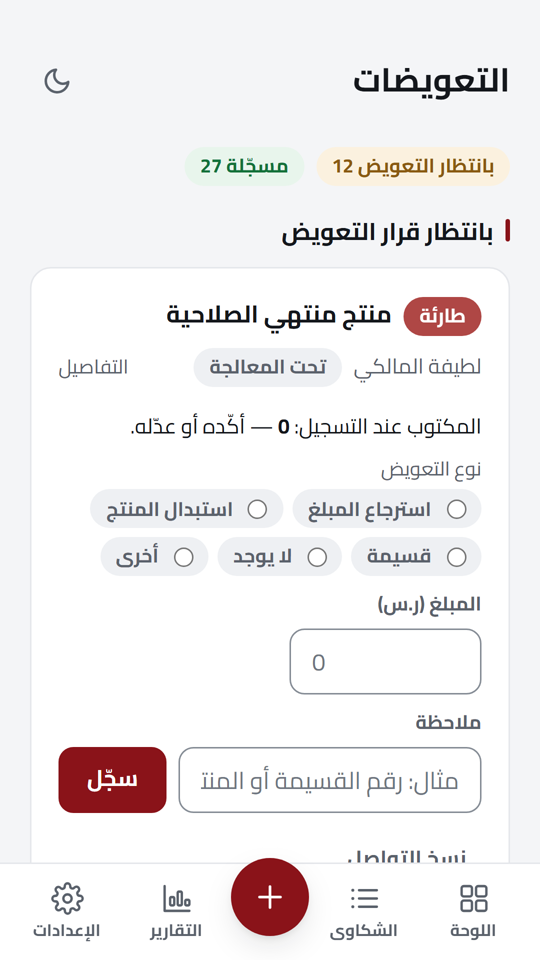
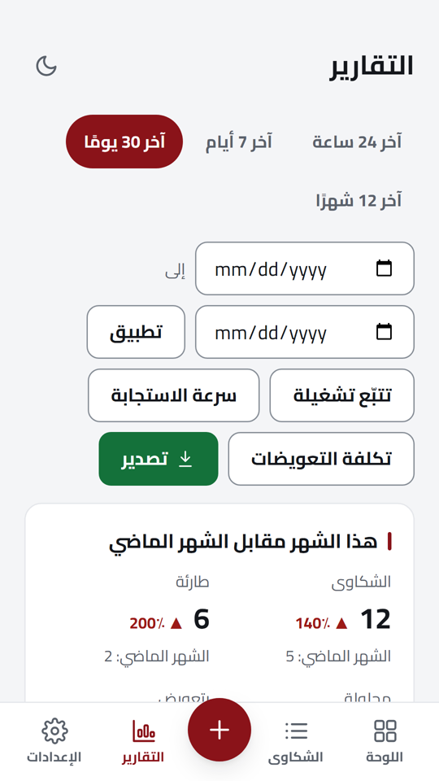
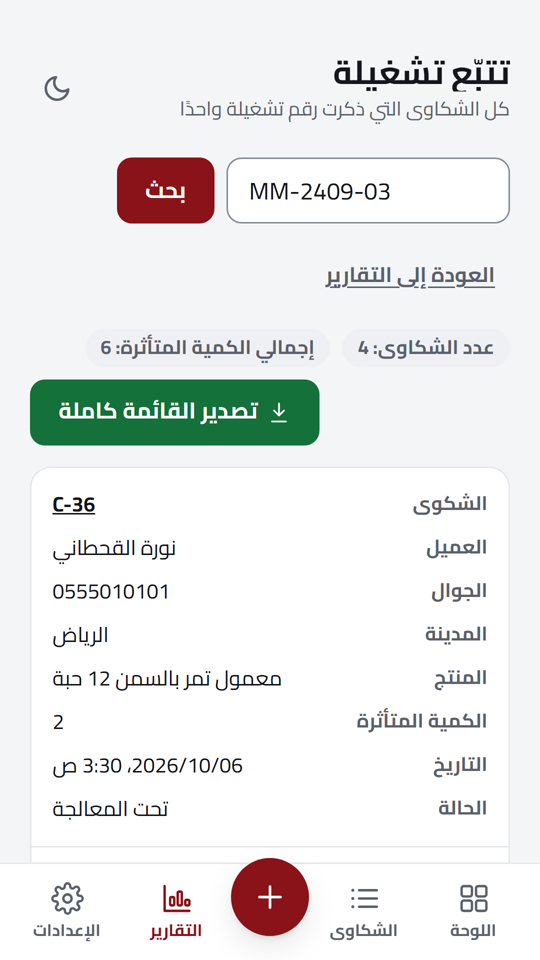
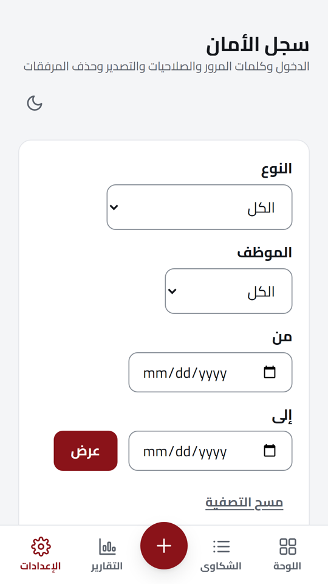

[English](README.md) · **العربية**

# نظام إدارة شكاوى العملاء

تطبيق ويب لتسجيل شكاوى العملاء ومتابعتها للمتاجر الإلكترونية على سلة. بالعربي ومن اليمين لليسار.

[النسخة التجريبية](https://complaints-saas-demo.vercel.app) · [فيديو جولة ٤٢ ثانية](media/features-42s.mp4)

للتجربة: افتح النسخة التجريبية واختر دورًا من شاشة الدخول: المالك، مديرة الجودة، مدير المصنع، أو خدمة العملاء. كل دور له شاشات مختلفة. كل الأسماء والأرقام والطلبات في النسخة التجريبية وهمية.

تطوير: **محمد الطونسي**، [LinkedIn](https://www.linkedin.com/in/mohammed-altounsi/)

---

## الشاشات

<table>
<tr>
<td align="center"> لوحة المتابعة</td>
<td align="center"> تسجيل شكوى</td>
<td align="center"> شكوى طارئة</td>
<td align="center"> شكاوى الجودة</td>
</tr>
<tr>
<td align="center"> التعويضات</td>
<td align="center"> التقارير</td>
<td align="center"> البحث بالتشغيلة</td>
<td align="center"> سجل الأمان</td>
</tr>
</table>

## المزايا

### تسجيل الشكوى
- البحث بجوال العميل أو رقم الطلب أو الإيميل، وبيانات الطلب من سلة تنعبّى تلقائيًا.
- الشكوى الوحدة تشمل أكثر من منتج، ولكل منتج مشاكله ورقم تشغيلته.
- إرفاق صور وفيديو ورسائل صوتية من الجوال.
- شكاوى الفروع والقنوات الثانية تتسجّل بدون طلب.

### التوجيه
- كل شكوى تُسند لفريق الجودة أو للمصنع حسب نوع المشكلة.
- المسؤول يوصله إيميل فيه رقم الشكوى.

### الحالات الطارئة
- الشكوى الطارئة تروح دائمًا لمديرة الجودة، وتظهر بالأحمر أعلى كل شاشة.
- سحب عيّنة المنتج يحتاج موافقة شخصين، وسجل الموافقة ما ينعدل.

### التعويضات
- كل شكوى يتسجّل معها نوع التعويض ومبلغه وملاحظة.
- قائمة بالتعويضات اللي ما انصرفت.
- تقرير تكلفة حسب الشهر والمنتج والتشغيلة.

### التقارير
- اتجاه الشكاوى، والتوزيع حسب المنتج والمدينة والقناة.
- البحث بالتشغيلة: كل الشكاوى المرتبطة بتشغيلة إنتاج وحدة.
- سرعة الرد لكل فريق.
- تصدير Excel مع اختيار الأوراق.

### غير ذلك
- رسالة واتساب جاهزة للعميل فيها اسم المنتج ورقم الطلب.
- المالك يضيف الموظفين ويغيّر أدوارهم ويعيد تعيين كلمات المرور. آخر شخص نشِط في أي دور ما يمكن تعطيله.
- حذف أو تعديل البيانات المهمة يطلب تأكيد أول.
- عمليات الدخول تتسجّل، والحساب يتوقف مؤقتًا بعد تكرار كلمة مرور غلط.
- الطلبات توصل من سلة عبر الـ Webhooks، ومهمة ليلية تسحب أي طلب فات.
- فحص الحالة يعرض وضع الربط مع سلة والمهمة الليلية ومساحة التخزين.
- مصمم للجوال أولًا، وفيه وضع ليلي.

## التقنيات

Next.js 16، React 19، TypeScript، Supabase (Postgres، Auth، Storage)، Tailwind CSS 4، Vercel، PostHog (EU).

## الأمان

- بيانات كل متجر مفصولة بخاصية Row-Level Security في Postgres.
- صور العملاء ومقاطعهم في تخزين خاص، وتنفتح بروابط تنتهي صلاحيتها.
- مفاتيح الوصول لسلة مشفّرة في قاعدة البيانات.
- سياسة أمان المحتوى تمنع المواقع الثانية من تضمين التطبيق.

---

الشيفرة المصدرية خاصة، وهذا المستودع فيه لقطات شاشة وفيديو قصير. لجولة في التطبيق أو نسخة تجريبية لمتجرك، راسلني على [LinkedIn](https://www.linkedin.com/in/mohammed-altounsi/).

